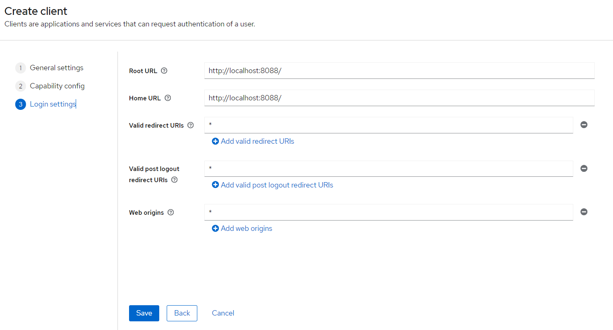

# superset-oidc

Module to use oidc as part of superset authentication.

Superset must be configured to use the module. 

A working example is located [here](./example/).

An example of configuration is located to [superset_config.py](./example/build/superset/superset_config.py).

Also, don't forget to include [client_secret.json](./example/build/superset/client_secret.json).

*Only tested with superset 4*

## Configuration keys

| key                                | type                   | description                                 |
| ---------------------------------- | ---------------------- | ------------------------------------------- |
| CUSTOM_AUTH_USER_REGISTRATION_ROLE | `string` (a role name) | Default role attributed to a superset user. |

## Limitations

Here are the limitation and the impacts on the superset instance.

- Role affectation in superset is obselete with this module.

## How roles are managed

The roles provided by the OIDC provider is the source of truth. We overwrite role affectation in superset with the JWT `roles` claim.

Roles must exist in superset to be assigned (mapping is *case insensitive*) and a default role (`CUSTOM_AUTH_USER_REGISTRATION_ROLE`) is always set.

## Running example

- With docker, run the [docker-compose.yml](./example/docker-compose.yml)

```bash
cd example
docker compose up -d --build --force-recreate
```

- go to [http://localhost:8080](http://localhost:8080) and connect as `admin`:`admin`
  - Create client `superset` on realm `master`
  - Toggle client authentication
    - root url and home url: `http://localhost:8088`
    - fill as depicted here
      
    - Go to clients > superset > credentials > copy the client secret and paste it in [client_secret.json](./example/build/superset/client_secret.json) on field `client_secret`
    - restart superset `docker compose up -d --build --force-recreate superset`
    - Create a user. Don't forget to fill in first name and last name.
    - Add credentials to the user.

Now, you can visit [http://localhost:8088](http://localhost:8088) and authenticate with previously setup user.


## Resources

Heavily inspired of this [article](https://blog.devgenius.io/running-superset-with-openidconnect-keycloak-in-docker-9ef1558d1ea3) 
